# CRIMENET: Global Crime Intelligence Engine

## Project Overview

CRIMENET is an advanced analytical platform designed for global crime intelligence extraction and analysis. This research-driven system integrates cutting-edge natural language processing, machine learning, and database technologies to process crime-related information from diverse sources. The platform enables law enforcement agencies, researchers, and policy analysts to identify patterns, predict trends, and derive actionable insights from global crime data.

## Core Components

### 1. Data Acquisition Pipeline
- **Regional Scraping Modules**: Specialized collectors for global crime news across five regions:
  - European news sources
  - North American coverage
  - South American reports
  - Oceania crime data
  - International news agencies
- **Title Classification System**: Machine learning models to identify crime-related content from news titles

### 2. Natural Language Processing Engine
- **Article Deduplication**: NLP models evaluating similarity scores to eliminate redundant reports
- **Information Extraction**: LLM-powered extraction of structured crime data entities and relationships
- **Semantic Analysis**: Vector embeddings for contextual understanding of crime narratives

### 3. Data Processing Framework
- **Structured Schema Design**: Comprehensive data model for crime entity relationships
- **Transformation Pipeline**: Conversion of unstructured text to standardized formats
- **MySQL Implementation**: Optimized relational database for crime data storage

### 4. Intelligence Analytics Module
- **Temporal Trend Analysis**: Time-series examination of crime patterns
- **Predictive Modeling**: Machine learning for crime prediction and follow-up recommendations
- **Semantic Query Interface**: Natural language search across structured and unstructured data

### 5. Model Evaluation System
- **LLM Benchmarking**: Comparative analysis of language models for crime analytics tasks
- **Performance Metrics**: Standardized evaluation framework for extraction and prediction accuracy

## Technical Architecture

```mermaid
graph TD

%% Color Legend
%% Automation: Light Blue
%% Scraping/Data Collection: Orange
%% Crime Processing: Red
%% Storage: Purple
%% AI Processing: Teal
%% API/Interface: Green
%% Analytics: Gold

%% â± GitHub Actions Automation - Light Blue
A[Start: GitHub Action Trigger / Daily Schedule]:::automation --> B1[Load Source Configs 200+ sites]:::automation

%% 🧱 Strategy-based Scraping - Orange
B1:::automation --> B2[Run Strategy Scrapers]:::scraping
B2:::scraping --> B3[Get HomePage News URLs]:::scraping

%% Pull News - Orange
B3:::scraping --> C1[Pull full text along with category if found]:::scraping
C1:::scraping -->|If Crime| D1[Label as crime and store]:::crime
C1:::scraping -->|Not Crime| Z1[Store to Database]:::storage

%% 🔠Deduplication - Yellow
D1:::crime --> E3[Deduplication and Cross Referencing]:::processing
E3:::processing -->|Unique| F1[Send to Information Extractor]:::ai
E3:::processing -->|Exact Duplicate| X1[Skip & Log Duplicate]:::processing

%% 🧠 Information Extraction - Teal
F1:::ai --> F2[Run Extractor]:::ai
F2:::ai --> F3[Extract: who, what, where, when, why, how, etc.]:::ai
F3:::ai --> F4[Create structured schema]:::ai

%% 💾 Storage Layer - Purple
F4:::ai --> G1[Insert into SQL DB]:::storage
F4:::ai --> G2[Generate SBERT Vectors]:::storage
G2:::storage --> G3[Insert into Vector DB]:::storage

%% 🔠API and UI Interface - Green
G1:::storage --> H1[REST/GraphQL API for Filtered Search]:::api
G3:::storage --> H2[Semantic Search Interface]:::api

%% 📊 Analytics Engine - Gold
G1:::storage --> J1[Trend Analysis Engine]:::analytics
J1:::analytics --> J2[Crime Frequency/Location Map]:::analytics
J1:::analytics --> J4[Temporal Story Chain Finder using LLMs]:::analytics

%% Style Definitions
classDef automation fill:#D6EAF8,stroke:#3498DB,stroke-width:2px;
classDef scraping fill:#FDEBD0,stroke:#E67E22,stroke-width:2px;
classDef crime fill:#FADBD8,stroke:#E74C3C,stroke-width:2px;
classDef processing fill:#FCF3CF,stroke:#F1C40F,stroke-width:2px;
classDef ai fill:#D1F2EB,stroke:#1ABC9C,stroke-width:2px;
classDef storage fill:#EBDEF0,stroke:#9B59B6,stroke-width:2px;
classDef api fill:#D5F5E3,stroke:#2ECC71,stroke-width:2px;
classDef analytics fill:#FEF9E7,stroke:#F39C12,stroke-width:2px;

%% Add these two lines for black text:
%% linkStyle default stroke:transparent
classDef allNodes color:black
class A,B1,B2,B3,C1,D1,Z1,E3,F1,X1,F2,F3,F4,G1,G2,G3,H1,H2,J1,J2,J4 allNodes

```

## Research Directions

1. **Cross-lingual Crime Pattern Recognition**
   - Multilingual NLP for comparative analysis of crime trends across regions
   - Cultural context modeling for crime manifestation differences

2. **Predictive Policing Models**
   - Spatiotemporal forecasting of crime hotspots
   - Resource allocation optimization algorithms

3. **LLM Specialization for Legal Domains**
   - Domain-specific fine-tuning of language models
   - Ethical framework development for AI-assisted law enforcement

4. **Network Analysis Integration**
   - Criminal organization mapping through entity relationships
   - Link prediction for undiscovered connections

## License

This research platform is available under the Academic Public License (APL) for non-commercial research use. Commercial applications require explicit authorization from the principal investigators.

## Research Team

CRIMENET is developed by the Voyager Group of Systems and Software Lab of Islamic University of Technology.
